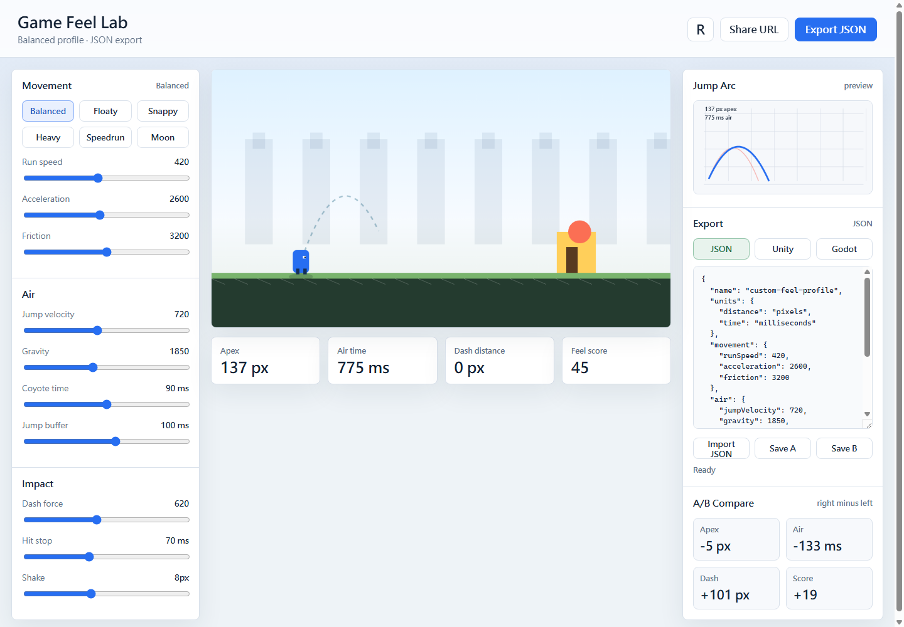

# Game Feel Lab

Game Feel Lab is a browser-based tuning tool for game developers working on platformer movement and action feedback. It lets you adjust movement, jumping, dash force, hit stop, and camera shake while immediately testing the result in a small playable sandbox.

The exported JSON is engine-neutral, so it can be copied into Unity, Godot, Unreal, custom engines, or design docs.



## Features

- Live movement sandbox with keyboard input.
- Tunable run speed, acceleration, friction, gravity, jump velocity, coyote time, and jump buffering.
- Dash, hit stop, and screen shake controls for action feel.
- Jump arc preview and gameplay metrics.
- Engine-neutral JSON import/export.
- Unity and Godot snippet export.
- Shareable profile URLs.
- A/B comparison slots for tuning passes.
- Runs as a static site with no build step.

## Controls

- `A` / `D` or arrow keys: move.
- `Space`: jump.
- `Shift`: dash.
- `J`: trigger hit stop and shake.

## Workflow

- Use the preset buttons to start from a known feel profile.
- Switch export format between JSON, Unity, and Godot.
- Paste an exported JSON profile into the export box and press `Import JSON`.
- Press `Share URL` to encode the current profile into the page URL.
- Press `Save A` and `Save B` to compare two tuning passes.

## Run Locally

Open [index.html](index.html) in a browser.

If your browser blocks module loading from local files, run a tiny local server:

```bash
python -m http.server 8000
```

Then open:

```text
http://localhost:8000
```

## Test

```bash
npm test
```

## Project Structure

```text
index.html
package.json
src/
  app.js
  simulation.js
  styles.css
presets/
  balanced.json
  heavy.json
  moon.json
  snappy.json
  speedrun.json
tests/
  simulation.test.mjs
```

## Export Format

```json
{
  "name": "custom-feel-profile",
  "movement": {
    "runSpeed": 420,
    "acceleration": 2600,
    "friction": 3200
  },
  "air": {
    "jumpVelocity": 720,
    "gravity": 1850,
    "coyoteTime": 90,
    "jumpBuffer": 100
  },
  "impact": {
    "dashForce": 620,
    "hitStop": 70,
    "shake": 8
  }
}
```

## Roadmap

- Import JSON profiles.
- Timeline view for input buffering and coyote windows.
- More player archetypes, including top-down and twin-stick movement.
- Direct export templates for more engines.
- Local profile library with named saved profiles.

## Contributing

Pull requests are welcome. Keep the app dependency-free unless a dependency clearly improves the core workflow for game developers.

## License

MIT
